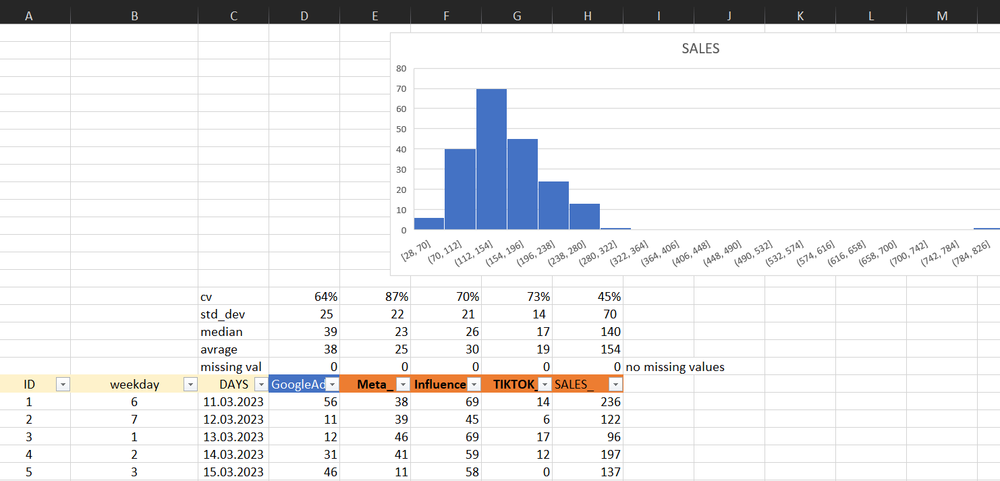

# 📊 Digital Ads & Sales Regression Analysis

Bu proje, dijital reklam harcamalarının (Google Ads, Meta, TikTok, Influencer) satışlar üzerindeki etkisini analiz eder. Aykırı değerlerin (outliers) belirlenmesi, baskılanması ve sonrasında regresyon analizi ile hangi reklam kanalının yatırım geri dönüşünü (ROI) daha çok artırdığı ortaya konmuştur.

## 🔍 Amaç

- Dijital medya harcamalarının satışa etkisini keşfetmek  
- Aykırı değerleri istatistiksel olarak tespit edip baskılamak  
- Temiz veri ile regresyon analizi yapmak  
- Karar destek amaçlı en verimli reklam kanallarını belirlemek  

---

## 📁 Adımlar

### 1. 🧹 Missing Value Temizliği

İlgili kolonlardaki eksik veriler analiz dışında bırakıldı. Sadece dolu olan veriler kullanıldı.


---

### 2. 📈 Aykırı Değer Analizi

Google Ads ve Sales kolonlarında **Box Plot (kutu grafiği)** ile uç değerler (outlier) tespit edildi.




**QUARTILE** fonksiyonu ile çeyrek değerler ve IQR hesaplandı:

```
Q1 = 25. yüzdelik değer  
Q3 = 75. yüzdelik değer  
IQR = Q3 - Q1  
```

Outlier sınırları:
- **Lower Limit** = Q1 − 1.5 × IQR  
- **Upper Limit** = Q3 + 1.5 × IQR  


---

### 3. 🚫 Aykırı Değerleri Baskılama

`IF` fonksiyonu ile outlier olan değerler upper limit’e eşitlendi.

```excel
=IF(D23 > $D$10; $D$10; D23)
```

Sağa doğru kopyalanabilir hale getirmek için kolon sabitleme ayarlandı.


---

### 4. 📊 Regresyon Öncesi Temizlik

Aykırı değerler baskılandıktan sonra elimizde sadece güvenilir veriler kaldı. Regresyon modeline bu veriler dahil edildi.


---

### 5. 🔁 Korelasyon ve Scatter Analizleri

Google Ads harcamaları ile satışlar arasındaki ilişki korelasyon grafiği ile incelendi:


- 100 TL'lik Google Ads harcamasında 1.46 katsayısı ile 146 TL'lik satış gelirine ulaşıldı.
- Hiç reklam yapılmasa dahi 90 TL civarı **marka değeriyle gelen doğal satış** tespit edildi.

---

### 6. 📐 Regresyon Sonuçları

Excel'in **Data Analysis** modülü ile yapılan regresyon analizi sonucunda, farklı kanallara yapılan yatırımların getirileri hesaplandı:

| Kanal        | Harcama | Katsayı | Tahmini Gelir |
|--------------|---------|---------|----------------|
| Google Ads   | 30 TL   | 1.43    | 42.9 TL        |
| Influencer   | 50 TL   | 0.24    | 12 TL          |
| TikTok       | 20 TL   | 0.68    | 13.6 TL        |

Toplam tahmini gelir: **68.5 TL**


---

## ✅ Sonuçlar

- **Google Ads** yatırımının satışa en büyük katkıyı sağladığı tespit edildi.
- Marka değerinden gelen satışlar (90 TL) sabit kalırken, reklam harcamaları bu değeri yukarı çekmektedir.
- **Tiktok** ve **Influencer** harcamaları belirli seviyede katkı sağlamaktadır, fakat ROI oranı Google Ads'e göre daha düşüktür.
- Aykırı değerlerin baskılanması, model doğruluğunu önemli ölçüde artırmıştır.

---

## 🧠 Öğrenilenler

- Excel ile **IQR, QUARTILE, IF** fonksiyonları sayesinde istatistiksel temizlik yapılabilir.
- Regresyon analizi karar destek süreçlerinde güçlü içgörüler sağlar.
- Veriye dayalı kararlar ile dijital pazarlama bütçesi optimize edilebilir.

---

## 📌 Kullanılan Araçlar

- Microsoft Excel (Statistical Formulas & Data Analysis ToolPak)
- Scatter Plot, Pivot Table, Linear Regression

---

## 📎 Görseller

Tüm görseller `images/` klasöründe yer almakta. Örnek:  
```markdown

```

---

## 🧩 LinkedIn Paylaşım Önerisi:

```
📊 Dijital Reklam ve Satış Analizi (Excel & İstatistik)

Google Ads, Meta, TikTok ve Influencer harcamalarının satışlara etkisini analiz ettim. Aykırı değerleri baskılayarak regresyonla en verimli kanalı belirledim.

🛠 Araçlar: Excel, QUARTILE, IQR, IF, Regression  
📈 Sonuç: Google Ads harcamasında 1.43 katsayı ile en yüksek dönüş alındı.  
🧠 Öğrenilenler: İstatistiksel temizlik ve veri analizi karar süreçlerinde altın değerinde.

📎 Proje GitHub'da: [GitHub Linkini buraya koy]

#dataanalysis #excel #regression #digitalmarketing #portfolio #dataproject
```
