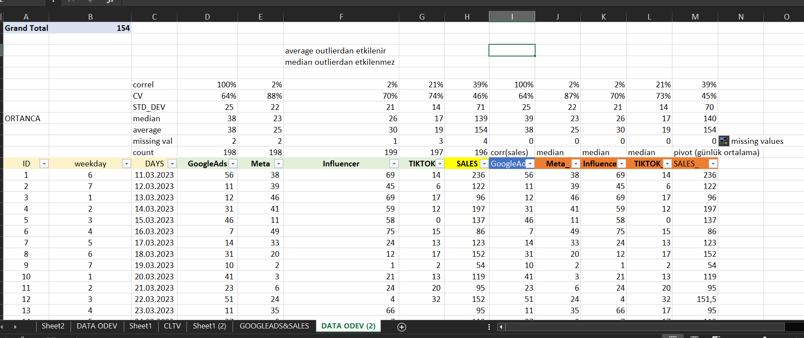
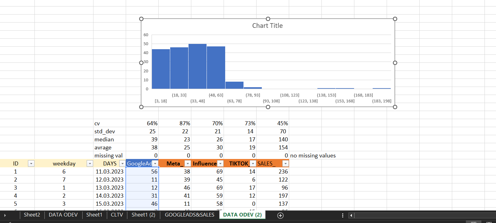
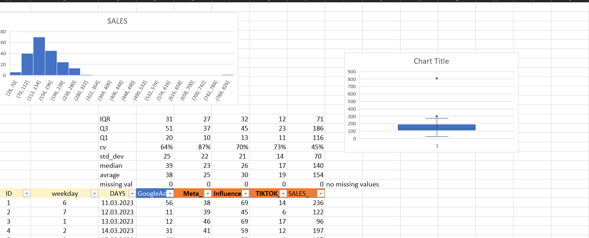
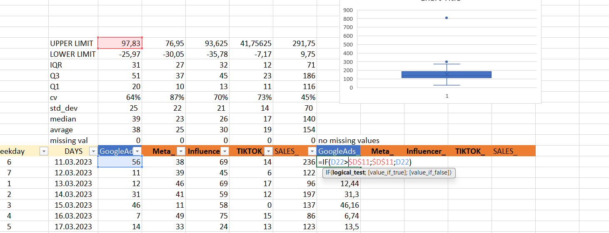
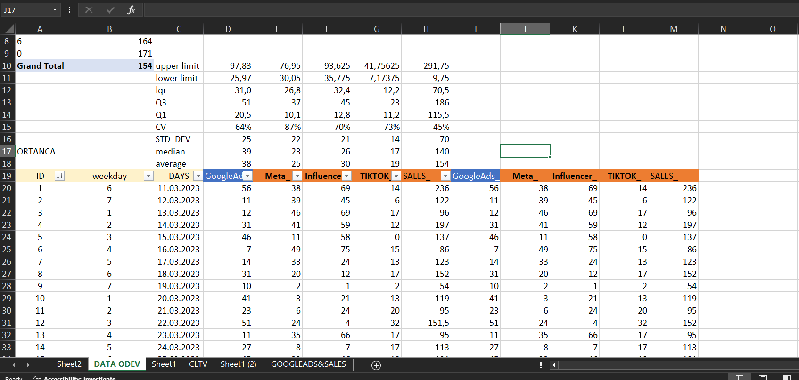
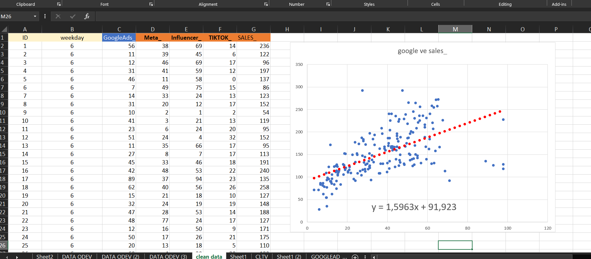
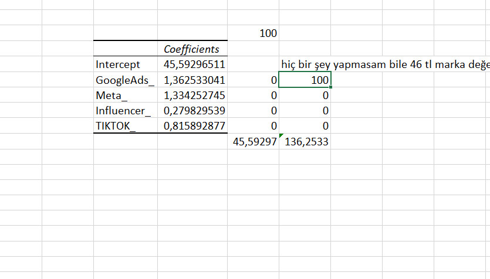

# 📊 Digital Ads & Sales Regression Analysis

Bu proje, dijital reklam harcamalarının (Google Ads, Meta, TikTok, Influencer) satışlar üzerindeki etkisini analiz eder. Aykırı değerlerin (outliers) belirlenmesi, baskılanması ve sonrasında regresyon analizi ile hangi reklam kanalının yatırım geri dönüşünü (ROI) daha çok artırdığı ortaya konmuştur.

## 🔍 Amaç

- Dijital medya harcamalarının satışa etkisini keşfetmek  
- Aykırı değerleri istatistiksel olarak tespit edip baskılamak  
- Temiz veri ile regresyon analizi yapmak  
- Karar destek amaçlı en verimli reklam kanallarını belirlemek  

---

## 📁 Adımlar

### 1. 🧹 Missing Value Temizliği

İlgili kolonlardaki eksik veriler analiz dışında bırakıldı. Sadece dolu olan veriler kullanıldı.



---

### 2. 📈 Aykırı Değer Analizi

Google Ads ve Sales kolonlarında **Box Plot (kutu grafiği)** ile uç değerler (outlier) tespit edildi.



📌 Argümanlar:
dizi: İncelenecek sayıların olduğu hücre aralığı.
çeyrek: Hangi çeyreği almak istediğini belirtir.
0 → Minimum değer (Q0)
1 → 1. çeyrek (Q1) → %25
2 → 2. çeyrek (Q2) → Medyan → %50
3 → 3. çeyrek (Q3) → %75
4 → Maksimum değer (Q4)
🔍 Ne İşe Yarar?
Veri dağılımını analiz eder:

⚠️ Not:
Yeni Excel sürümlerinde QUARTILE yerine QUARTILE.INC ve QUARTILE.EXC kullanman önerilir:
QUARTILE.INC → %0 ile %100 dahil edilir (standarttır)
QUARTILE.EXC → %0 ve %100 hariç tutulur

**QUARTILE** fonksiyonu ile çeyrek değerler ve IQR hesaplandı:

```
Q1 = 25. yüzdelik değer  
Q3 = 75. yüzdelik değer  
IQR = Q3 - Q1  
```

Outlier sınırları:
- **Lower Limit** = Q1 − 1.5 × IQR  
- **Upper Limit** = Q3 + 1.5 × IQR  



---

### 3. 🚫 Aykırı Değerleri Baskılama

`IF` fonksiyonu ile outlier olan değerler upper limit’e eşitlendi.

```excel
=IF(D23 > $D$10; $D$10; D23)
```
## KAVRAMLAR:

### 🔹 Q1 (Quartile 1 / 1. Çeyrek):

- Verilerin %25’inin altında kaldığı değerdir.
- Küçük değerli verilerin sınırını gösterir.

### 🔹 Q3 (Quartile 3 / 3. Çeyrek):

- Verilerin %75’inin altında kaldığı değerdir.
- Büyük değerli verilerin sınırını gösterir.

### 🔹 IQR (Interquartile Range / Çeyrekler Arası Aralık):

- **IQR = Q3 - Q1**
- Verilerin orta %50’lik kısmının yayılımını gösterir.

---

## ⚠️ UÇ DEĞER ANALİZİ:

İstatistikte uç değerleri (aykırı değerler) bulmak için şu sınırlar kullanılır:

- **Alt sınır (lower bound)** = Q1 − 1.5 × IQR
- **Üst sınır (upper bound)** = Q3 + 1.5 × IQR

Bu sınırların **dışında kalan** veriler **aykırı (uç) değer** olarak kabul edilir.

---

## 🔢 ÖRNEK:

Veri kümesi:

`5, 7, 8, 9, 10, 11, 12, 13, 14, 30`

- Q1 = 8
- Q3 = 13
- IQR = Q3 - Q1 = 13 - 8 = **5**
Sağa doğru kopyalanabilir hale getirmek için kolon sabitleme ayarlandı.



---
📌 Formül yapısı:

IF(logical_test; value_if_true; value_if_false)
​
Bu yapıda:
D23 > $D$10: Şartımız (upper limitten büyük mü?)
$D$10: Eğer büyükse ne yazılacak? (upper limit ile baskılanıyor)
D23: Değilse orijinal değeri koru


### 4. 📊 Regresyon Öncesi Temizlik

Aykırı değerler baskılandıktan sonra elimizde sadece güvenilir veriler kaldı. Regresyon modeline bu veriler dahil edildi.



---

### 5. 🔁 Korelasyon ve Scatter Analizleri

Google Ads harcamaları ile satışlar arasındaki ilişki korelasyon grafiği ile incelendi:



- 100 TL'lik Google Ads harcamasında 1.46 katsayısı ile 146 TL'lik satış gelirine ulaşıldı.
- Hiç reklam yapılmasa dahi 90 TL civarı **marka değeriyle gelen doğal satış** tespit edildi.

---

### 6. 📐 Regresyon Sonuçları

Excel'in **Data Analysis** modülü ile yapılan regresyon analizi sonucunda, farklı kanallara yapılan yatırımların getirileri hesaplandı:

| Kanal        | Harcama | Katsayı | Tahmini Gelir |
|--------------|---------|---------|----------------|
| Google Ads   | 30 TL   | 1.43    | 42.9 TL        |
| Influencer   | 50 TL   | 0.24    | 12 TL          |
| TikTok       | 20 TL   | 0.68    | 13.6 TL        |

Toplam tahmini gelir: **68.5 TL**



---

## ✅ Sonuçlar

- **Google Ads** yatırımının satışa en büyük katkıyı sağladığı tespit edildi.
- Marka değerinden gelen satışlar (90 TL) sabit kalırken, reklam harcamaları bu değeri yukarı çekmektedir.
- **Tiktok** ve **Influencer** harcamaları belirli seviyede katkı sağlamaktadır, fakat ROI oranı Google Ads'e göre daha düşüktür.
- Aykırı değerlerin baskılanması, model doğruluğunu önemli ölçüde artırmıştır.

---

## 🧠 Öğrenilenler

- Excel ile **IQR, QUARTILE, IF** fonksiyonları sayesinde istatistiksel temizlik yapılabilir.
- Regresyon analizi karar destek süreçlerinde güçlü içgörüler sağlar.
- Veriye dayalı kararlar ile dijital pazarlama bütçesi optimize edilebilir.

---

## 📌 Kullanılan Araçlar

- Microsoft Excel (Statistical Formulas & Data Analysis ToolPak)
- Scatter Plot, Pivot Table, Linear Regression

---


